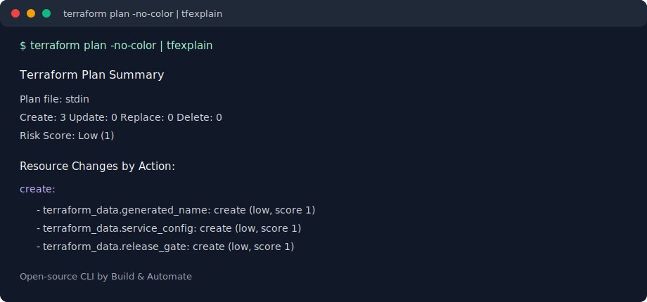

# tfexplain

[](#)
[](LICENSE)
[](#)

`tfexplain` is an open-source CLI for explaining Terraform code, saved Terraform plans, Terraform JSON plans, and piped Terraform plan text.

Author: Vijay Daswani  
Company: Build & Automate  
Website: [buildnautomate.com](https://buildnautomate.com)  
Package: `bna-tools/tfexplain`  
Community: [Join the Build & Automate Slack](https://join.slack.com/share/enQtMTE1MTg1ODM3NDgyNTctYjczZWU2MDkxZWJhNWUyZTNjYTAxYzE1ZWJlMWQ0NDhmNTQ1YmM4YTM0MTc1YzA3NDJiM2FjZjA1ZjMxOGEzZg?entry_point=redirect_flow)

By default, `tfexplain` is deterministic and dependency-free. It does not call AI services, does not run `terraform apply`, and does not send code or plan contents anywhere. AI-assisted output is available only when you explicitly pass `--ai`.



## Why tfexplain?

Terraform plans are powerful but noisy. `tfexplain` turns Terraform code and plan output into readable summaries for engineers, reviewers, and CI/CD pipelines.

## Safety & Privacy

- No AI calls unless `--ai` is passed.
- No `terraform apply`.
- No cloud changes.
- Plan/code analysis runs locally.
- Secrets are redacted before AI requests.

## Install for Development

```bash
python3 -m venv .venv
. .venv/bin/activate
python -m pip install -e .
```

PyPI install, planned for a later release:

```bash
pip install tfexplain
```

You can also run it without installing:

```bash
PYTHONPATH=src python3 -m tfexplain --help
```

## Explain a Terraform Plan

Pipe-friendly local workflow:

```bash
terraform plan -no-color | tfexplain
```

Raw plan text gives an action/resource summary. For richer field-level details, use a saved plan or Terraform JSON.

```bash
terraform plan -out=tfplan
tfexplain plan tfplan
```

You can also pass Terraform JSON if you prefer to generate it yourself:

```bash
terraform show -json tfplan > plan.json
tfexplain plan plan.json
```

Or stream Terraform JSON through stdin:

```bash
terraform show -json tfplan | tfexplain plan -
```

Passing a saved binary plan file requires the `terraform` executable to be installed because `tfexplain` converts it locally with `terraform show -json`.

This also works:

```bash
terraform plan -out=tfplan
terraform show -json tfplan | tfexplain plan -
```

Useful options:

```bash
tfexplain plan plan.json --format markdown --output summary.md
tfexplain plan tfplan --group-by risk --show-fields
tfexplain plan tfplan --fail-on delete,replace,high
```

## Explain Terraform Code

```bash
tfexplain code .
tfexplain code ./modules/network --format json
```

The code scanner reports providers, modules, resources, variables, outputs, backend settings, README/examples presence, variable descriptions, validation blocks, and high-attention resource types.

## Explain Code and Plan Together

```bash
tfexplain explain --code . --plan plan.json --format markdown
```

## Review, Docs, Graph, and Init

Generate a PR-oriented review summary:

```bash
tfexplain review --code . --plan tfplan --format markdown
tfexplain review --code . --plan tfplan --format github
tfexplain review --plan plan.json --fail-on delete,replace,high
```

Generate module documentation:

```bash
tfexplain docs . --output TERRAFORM.md
tfexplain docs . --format json
```

Generate a lightweight graph:

```bash
tfexplain graph . --format text
tfexplain graph . --format ascii
tfexplain graph . --format mermaid
tfexplain graph . --format dot
```

Create a local config file:

```bash
tfexplain init
tfexplain init --force
```

## Samples

Sample Terraform code and plan fixtures live in `samples/`.

```bash
tfexplain code samples/terraform-code/aws-webapp
tfexplain code samples/terraform-code/local-pipe-plan
tfexplain plan samples/plans/02-aws-rds-replace.json --show-fields
tfexplain explain --code samples/terraform-code/azurerm-aks --plan samples/plans/03-azurerm-aks-update.json --format markdown
```

To test the exact pipe workflow with no cloud or Kubernetes provider:

```bash
cd samples/terraform-code/local-pipe-plan
terraform init -backend=false
terraform plan -no-color | PYTHONPATH=../../../src python3 -m tfexplain
```

The plan fixtures cover AWS, AzureRM, Google, Kubernetes, Helm, Cloudflare, Datadog, Random, TLS, and Local providers across create, update, delete, replace, no-op, and module-addressed changes.

To generate real local `.tfplan` samples:

```bash
./samples/tfplans/generate.sh
tfexplain plan samples/tfplans/generated/terraform-data/create.tfplan
tfexplain plan samples/tfplans/generated/terraform-data/update-replace.tfplan --show-fields
```

## GitHub Action Example

```yaml
name: tfexplain

on:
  pull_request:

jobs:
  review:
    runs-on: ubuntu-latest
    permissions:
      contents: read
      pull-requests: write
    steps:
      - uses: actions/checkout@v4
      - uses: hashicorp/setup-terraform@v3

      - name: Install tfexplain
        run: |
          python -m pip install -e .

      - name: Terraform plan
        run: |
          terraform init
          terraform plan -out=tfplan

      - name: Generate tfexplain PR comment
        run: |
          tfexplain review --code . --plan tfplan --format github > tfexplain-review.md

      - name: Comment on PR
        uses: actions/github-script@v7
        with:
          script: |
            const fs = require('fs');
            const body = fs.readFileSync('tfexplain-review.md', 'utf8');
            await github.rest.issues.createComment({
              owner: context.repo.owner,
              repo: context.repo.repo,
              issue_number: context.issue.number,
              body,
            });
```

## Commands

```text
tfexplain plan <plan.json|tfplan|->
terraform plan -no-color | tfexplain
tfexplain code <directory>
tfexplain explain --code <directory> --plan <plan.json|tfplan|->
tfexplain review --code <directory> --plan <plan.json|tfplan|->
tfexplain docs <directory>
tfexplain graph <directory>
tfexplain init [directory]
tfexplain risk <plan.json|tfplan|->
tfexplain version
```

## AI Mode

AI output appends a generated explanation to the deterministic local analysis.

OpenAI:

```bash
export OPENAI_API_KEY=...
tfexplain plan tfplan --ai --provider openai
tfexplain code . --ai --provider openai --model gpt-4o-mini
```

Claude:

```bash
export ANTHROPIC_API_KEY=...
tfexplain review --code . --plan tfplan --ai --provider claude
```

Azure OpenAI:

```bash
export AZURE_OPENAI_API_KEY=...
export AZURE_OPENAI_ENDPOINT=https://example.openai.azure.com
tfexplain plan tfplan --ai --provider azure-openai --model <deployment-name>
```

Ollama:

```bash
ollama serve
tfexplain code . --ai --provider ollama --model llama3.1
```

Supported providers are `openai`, `claude`, `azure-openai`, and `ollama`. For JSON output, AI content is added under an `ai` object.

## Roadmap

- [ ] GitHub PR comment mode
- [ ] Azure DevOps summary output
- [ ] More provider-aware risk rules
- [ ] HTML report
- [ ] SARIF output
- [ ] Homebrew install

## Test

```bash
python3 -m unittest discover -s tests
```
